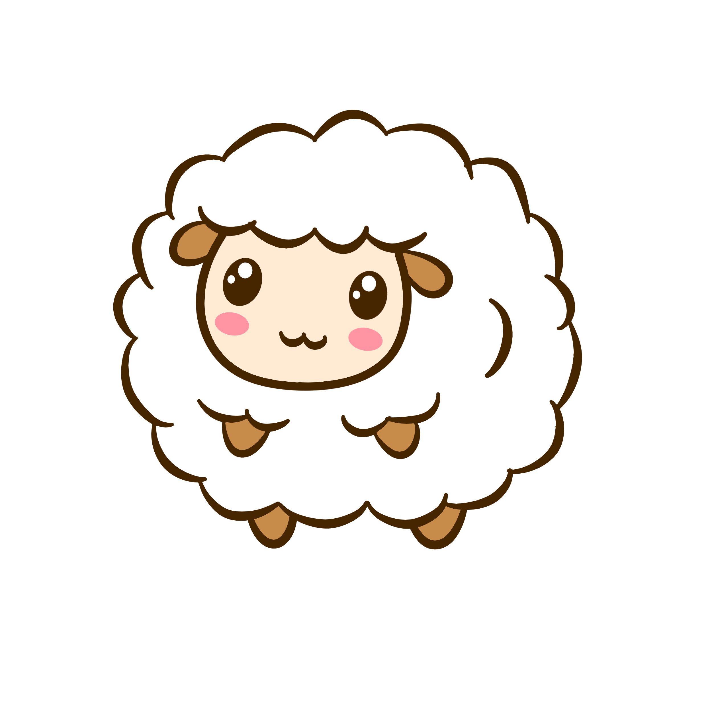

<h1>Contador de ovejas</h1>

Accede a esta app haciendo clic en la oveja:

   
## ¿Cómo se hizo?

Este proyecto es con el fin de reforzar conocimientos básicos en desarrollo Frontend, por eso está contruida con Html, CSS y Javascript Vanilla.

   
## ¿Qué sigue?

Estaré trabajando temporalmente en otro proyecto de práctica mientras se me ocurren nuevas features para el contador de ovejas.

